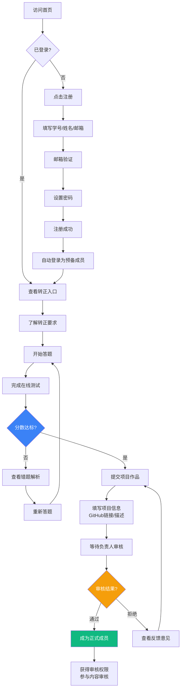
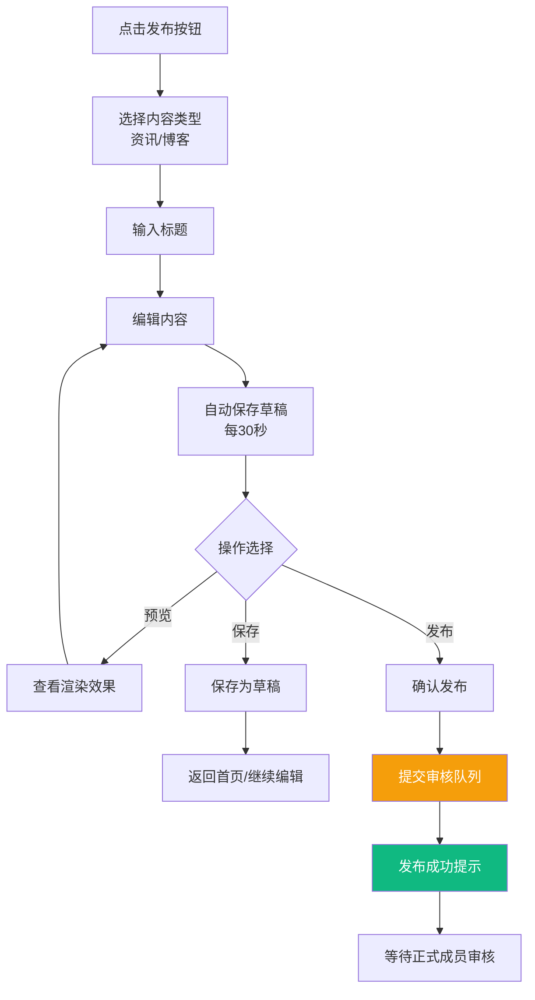
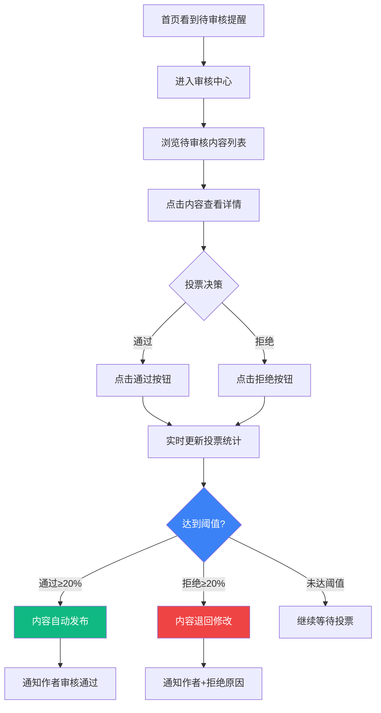

# UX Design Specification: 沈阳工业大学计算机程序设计社团官方网站

**Author:** Max
**Date:** 2026-04-02

---

## Executive Summary

### Project Vision

为沈阳工业大学计算机程序设计社团打造一个专属的官方网站系统，替代目前依赖微信群的信息发布方式。通过建立完整的成员成长体系（预备成员→正式成员→负责人）和内容审核机制，让社团拥有属于自己的数字化社区，实现知识的沉淀和传承。

### Target Users

**预备成员（约50人）**
- 刚加入社团的学生，正在学习阶段
- 核心需求：了解社团、学习技术、申请转正
- 技术能力：基础编程知识，正在学习中

**正式成员（约100人）**
- 通过考核的社团核心成员
- 核心需求：发布内容、参与审核、展示作品
- 技术能力：具备一定的项目经验和技术深度

**负责人**
- 社团管理层（社长、副社长等）
- 核心需求：管理成员、把控内容质量、社团运营
- 技术能力：技术能力强，有管理经验

### Key Design Challenges

1. **角色权限的清晰表达** — 三种角色有不同的权限，用户需要清楚知道自己能做什么，避免权限困惑
2. **审核机制的易用性** — 20%通过制的投票机制需要直观展示，降低正式成员参与审核的门槛
3. **转正流程的引导** — 预备成员需要清晰了解如何成为正式成员，流程不能让人迷失
4. **从微信群迁移的习惯培养** — 需要让用户感受到官网比微信群更有价值

### Design Opportunities

1. **成长可视化** — 清晰展示成员从预备到正式的成长路径，增强成就感和归属感
2. **社区归属感** — 通过设计营造社团的专属感和技术氛围，形成独特的社团文化
3. **内容发现** — 优秀技术博客的展示，形成知识沉淀的价值，吸引用户主动访问
4. **自治参与感** — 审核机制让正式成员有主人翁意识，增强社区参与度

---

## Core User Experience

### Defining Experience

**核心用户行为：**
- **最频繁**：浏览最新资讯和博客 — 用户每天打开网站，首先看到的是最新、最相关的内容
- **绝对不能出错**：转正申请流程 — 这是成员成长的关键路径，从申请→答题→提交项目→等待审核→获得结果，每一步都要有明确指引

**毫不费力的交互：**
- **找到想要的内容** — 强大的内容发现机制（最新、最热、按标签筛选），清晰的导航结构
- **清晰的转正流程** — 流程可视化展示当前阶段，明确的要求说明，随时可查看自己的分数和状态

### Platform Strategy

| 设备 | 使用场景 | 设计重点 |
|------|---------|---------|
| 手机 | 碎片时间浏览、快速查看通知 | 内容优先，操作简化 |
| 笔记本电脑 | 发布内容、答题、项目提交 | 完整功能，效率优先 |
| 微信内嵌浏览器 | 从微信群跳转访问 | 微信环境适配，快速加载 |

**微信适配要点：**
- 页面在微信内置浏览器中正常显示
- 页面加载速度要快（微信群跳转用户耐心有限）
- 支持微信分享（分享卡片样式）
- 考虑微信登录（可选，Phase 2）

### Critical Success Moments

1. **第一次打开首页** — 3秒内看到有价值的内容，产生"这个网站有用"的第一印象
2. **成功找到感兴趣的技术博客** — 搜索或浏览发现解决自己问题的文章
3. **提交转正申请后看到进度条** — 清晰感知自己的成长路径
4. **收到转正通过通知** — 成就感，正式成为社团核心成员
5. **第一次参与审核投票** — 感受到自己对社区的影响力

### Experience Principles

1. **内容即首页** — 打开即见最新最有价值的内容，零门槛获取信息
2. **成长可视化** — 转正流程、审核状态等进度一目了然，增强掌控感
3. **角色自适应界面** — 根据用户角色（预备/正式/负责人）动态展示功能和信息
4. **跨设备一致体验** — 手机和电脑无缝切换，核心功能全平台可用
5. **微信友好** — 从微信群到官网的跳转顺畅，降低迁移成本
6. **审核效率优先** — 让正式成员愿意参与审核，简化投票操作
7. **成长仪式感** — 关键节点（转正、首次发布等）有小庆祝

### Multi-Perspective Insights

**角色界面差异设计：**

| 角色 | 首页重点 | 导航差异 | 视觉提示 |
|------|---------|---------|---------|
| 预备成员 | 最新内容 + 转正入口 | 突出"申请转正" | 进度条显示当前状态 |
| 正式成员 | 最新内容 + 待审核提醒 | 增加"审核中心"入口 | 徽章标识身份 |
| 负责人 | 数据概览 + 待审批 | 增加"成员管理" | 特殊标识 |

**内容发现创新方式：**
- **每周精选** — 负责人/正式成员推荐的高质量内容
- **新人必读** — 为预备成员 curated 的入门内容清单
- **系列专题** — 将相关内容组织成学习路径
- **作者关注** — 用户可以关注喜欢的作者，接收更新通知

---

## Desired Emotional Response

### Primary Emotional Goals

**核心情感目标：**

1. **归属感** — "这是我的社团，我属于这里"
   - 通过社团视觉标识、成员展示、社区氛围营造

2. **成长感** — "我在这里不断进步，从预备到正式"
   - 通过进度可视化、里程碑庆祝、能力提升展示

3. **掌控感** — "我能影响这个社区，我的投票有价值"
   - 通过审核投票透明、个人贡献统计、权限清晰表达

4. **发现感** — "这里总有我想学的东西"
   - 通过智能推荐、精选内容、专题组织

### Emotional Journey Mapping

| 阶段 | 期望情感 | 设计支持 |
|------|---------|---------|
| **首次发现**（从微信群点击链接） | 好奇、期待 | 快速加载，内容吸引人 |
| **浏览内容** | 发现、满足 | 高质量内容，清晰分类 |
| **注册/登录** | 信任、简单 | 简洁流程，学号验证 |
| **申请转正** | 期待、动力 | 清晰进度，明确标准 |
| **通过转正** | 成就、自豪 | 庆祝动画，徽章授予 |
| **发布内容** | 创造、分享 | 简洁编辑器，预览功能 |
| **参与审核** | 责任、影响 | 投票简单，结果可见 |
| **日常使用** | 归属、习惯 | 个性化首页，通知及时 |

### Micro-Emotions

**关键情感状态设计：**

| 情感对比 | 设计目标 | 实现方式 |
|---------|---------|---------|
| **自信 vs 困惑** | 自信 | 角色标识清晰，权限一目了然 |
| **信任 vs 怀疑** | 信任 | 审核机制透明，规则明确展示 |
| **兴奋 vs 焦虑** | 兴奋 | 进度实时更新，预计时间明确 |
| **成就 vs 挫败** | 成就 | 里程碑庆祝，正向反馈 |
| **归属 vs 孤立** | 归属 | 成员展示，社区互动 |

### Design Implications

| 情感目标 | UX 设计方法 |
|---------|------------|
| **归属感** | 社团视觉标识、成员头像墙、"Made with ❤️"人文元素 |
| **成长感** | 进度条、徽章系统、成长时间线 |
| **掌控感** | 审核投票结果可视化、个人贡献统计 |
| **发现感** | 智能推荐、每周精选、系列专题 |
| **信任感** | 透明审核规则、明确的内容标准 |

### Emotional Design Principles

1. **每个交互都有温度** — 不只是功能完成，而是让用户感受到被尊重
2. **成长值得庆祝** — 转正、首次发布等节点有小惊喜
3. **透明带来信任** — 审核进度、投票状态实时可见
4. **社区有人情味** — 展示真实成员，不只是抽象的用户ID

---

## UX Pattern Analysis & Inspiration

### Inspiring Products Analysis

**1. GitHub**
- **做得好的地方**: 清晰的权限体系（Owner/Member/Contributor）、贡献可视化（Contribution Graph）
- **可借鉴**: 成员贡献统计、项目展示方式、PR 状态流程

**2. Notion**
- **做得好的地方**: 极简但功能强大的编辑器、清晰的侧边栏导航
- **可借鉴**: 内容编辑体验、层级化的信息组织

**3. 知乎/掘金（技术社区）**
- **做得好的地方**: 内容发现机制（推荐、关注、热榜）、用户成长体系（等级、徽章）
- **可借鉴**: 内容审核状态展示、作者关注机制、卡片式内容展示

**4. Discord**
- **做得好的地方**: 角色标识系统、社区氛围营造
- **可借鉴**: 用颜色/徽章区分角色、频道导航结构

**5. 参考网站 ustil.org**
- **做得好的地方**: 极简风格、清晰的信息架构
- **可借鉴**: 首页布局、导航结构、"Made with ❤️"人文元素

### Transferable UX Patterns

**导航模式:**
- **侧边栏 + 顶部导航** — 电脑端侧边栏展示主要功能，手机端底部标签栏
- **角色自适应导航** — 根据用户角色动态显示/隐藏菜单项
- **Figma 式简洁侧边栏** — 层级清晰，适合功能导航

**交互模式:**
- **卡片式内容展示** — 资讯/博客以卡片形式展示，清晰的信息层级（参考掘金）
- **进度可视化** — 步骤条展示转正流程，类似 GitHub PR 状态（圆点+连线）
- **投票组件** — 简洁的通过/拒绝按钮，实时显示投票统计
- **Linear 式进度展示** — 优雅的步骤条设计

**视觉模式:**
- **极简白/深色主题** — 参考 ustil.org 的 clean 风格
- **代码高亮** — Prism.js 或 highlight.js，支持 Java、Python、C/C++、JavaScript
- **徽章/标签** — 区分角色（预备=灰色、正式=蓝色、负责人=金色）和内容状态

### Anti-Patterns to Avoid

- ❌ **信息过载** — 首页不要堆砌太多功能入口，内容优先
- ❌ **隐藏的功能** — 审核投票等重要功能不要藏得太深，正式成员首页直接展示待审核提醒
- ❌ **复杂的转正流程** — 避免过多步骤造成用户流失，保持 5 步以内
- ❌ **不一致的交互** — 投票、发布等核心操作保持一致的交互模式
- ❌ **缺乏反馈** — 每个操作都要有明确的反馈（成功/失败/加载中）

### Design Inspiration Strategy

**采用:**
- GitHub 式的贡献可视化 → 用于成员成长展示
- 掘金式的内容卡片 → 用于资讯/博客列表
- Notion 式的简洁编辑器 → 用于内容发布
- Discord 式的角色标识 → 用颜色区分角色等级

**适配:**
- 简化的审核流程 → 适合学生社团的轻量级审核（一键投票）
- 移动端优先的导航 → 底部标签栏适应手机使用场景
- 渐进式披露 → 默认展示最常用功能，高级功能展开后可见

**技术实现建议:**
- **组件库**: Element Plus 或 Ant Design Vue（成熟稳定）或 TailwindCSS + Headless UI（更灵活）
- **响应式断点**: 手机<768px、平板768-1024px、电脑>1024px
- **代码高亮**: Prism.js 或 highlight.js

### Multi-Perspective Design Recommendations

**导航结构方案:**
```
电脑端:
[侧边栏]          [主内容区]
- Logo            - 内容展示
- 首页
- 资讯
- 博客
- 审核中心 (正式成员+显示)
- 成员管理 (负责人显示)
- 个人设置

手机端:
[底部标签栏]
首页 | 发现 | +发布 | 审核 | 我的
```

**投票交互设计:**
- 卡片式展示待审核内容
- 简洁的通过/拒绝按钮
- 实时显示当前投票统计（通过/拒绝数 + 进度条）
- 已投票内容标记为"已审核"

**转正流程可视化:**
```
[提交申请] ●━━━━━━○━━━━━━○━━━━━━○━━━━━━○ [完成]
           ↑
         当前步骤 (高亮)
```
- 5个节点：提交申请 → 答题 → 项目提交 → 审核中 → 完成
- 当前步骤高亮，已完成步骤打勾，未完成步骤灰色
- 每个节点可点击查看详情和预计时间

**首页角色自适应内容:**

| 功能 | 预备成员 | 正式成员 | 负责人 |
|------|---------|---------|--------|
| 首页 | 欢迎语 + 转正入口按钮 + 最新内容 | 待审核数量提醒 + 快捷发布 + 最新内容 | 数据概览 + 待办事项 |
| 导航 | 首页、资讯、博客、我的 | + 审核中心 | + 成员管理、系统设置 |
| 快捷操作 | 申请转正 | 发布内容、审核 | 发布通知、审批申请 |

---

## Design System Foundation

### 1.1 Design System Choice

**推荐方案：Element Plus + TailwindCSS 混合方案**

| 技术 | 用途 | 理由 |
|------|------|------|
| **Element Plus** | 主要组件库 | Vue 3 原生支持，中文文档友好，组件丰富 |
| **TailwindCSS** | 辅助样式 | 灵活的样式定制，实现 ustil.org 极简风格 |

**备选方案对比：**

| 设计系统 | 优点 | 缺点 | 适合度 |
|---------|------|------|--------|
| **Element Plus** | Vue 3 原生、中文文档、组件丰富 | 风格偏企业，需定制 | ⭐⭐⭐⭐⭐ |
| **Ant Design Vue** | 功能全面、企业级成熟 | 体积大、学习曲线陡 | ⭐⭐⭐ |
| **Vuetify** | Material Design、组件多 | 与 ustil.org 风格差异大 | ⭐⭐ |

### Rationale for Selection

1. **中文文档** — 对学生团队最友好，学习成本低
2. **Vue 3 原生支持** — 不需要适配层，性能更好
3. **组件丰富** — 覆盖 MVP 所有需求（表单、表格、对话框、导航）
4. **定制灵活** — 可通过 CSS 变量和 TailwindCSS 实现 ustil.org 风格
5. **维护简单** — 文档完善，社区活跃，问题容易解决

### Implementation Approach

**技术栈确认：**

| 层级 | 技术选择 | 版本 |
|------|---------|------|
| 前端框架 | Vue 3 | 3.4+ |
| 语言 | TypeScript | 5.0+ |
| 组件库 | Element Plus | 2.5+ |
| 样式工具 | TailwindCSS | 3.4+ |
| 状态管理 | Pinia | 2.1+ |
| 路由 | Vue Router | 4.2+ |
| 代码规范 | ESLint + Prettier | - |

**Element Plus 定制策略：**
```css
/* 主题变量覆盖 */
:root {
  --el-color-primary: #3b82f6;      /* 主色调：蓝色 */
  --el-border-radius-base: 8px;      /* 圆角 */
  --el-font-size-base: 16px;         /* 基础字号 */
}

/* 极简风格覆盖 */
.el-button {
  border-radius: 6px;
}

.el-card {
  border: none;
  box-shadow: 0 1px 3px rgba(0,0,0,0.1);
}
```

### Customization Strategy

**视觉风格定制：**
- **主色调**：蓝色系（#3b82f6），体现技术感
- **圆角**：6-8px，柔和但不失专业
- **阴影**：轻微阴影（0 1px 3px），保持层次感
- **留白**：大量留白，参考 ustil.org 的 clean 风格

**角色颜色标识：**
- **预备成员**：灰色（#9ca3af）
- **正式成员**：蓝色（#3b82f6）
- **负责人**：金色/琥珀色（#f59e0b）

**主题策略：**

**Phase 1（MVP）：**
- 仅支持浅色主题
- 通过 Element Plus CSS 变量定制

**Phase 2（可选）：**
- 增加深色主题
- 使用 TailwindCSS dark mode
- Element Plus 暗黑模式变量

**维护建议：**
1. **代码规范** — 强制使用 ESLint + Prettier
2. **组件文档** — 每个自定义组件都要有 README
3. **项目文档** — 详细的开发、部署、交接文档
4. **目录结构** — 按功能模块组织，清晰易懂

---

## 2. Core User Experience

### 2.1 Defining Experience

**定义性体验：**
> **"在技术社区中轻松分享和发现内容，通过参与审核获得成长与认可"**

**涵盖三个核心场景：**
1. **发现** — 浏览高质量技术内容
2. **分享** — 轻松发布自己的学习成果
3. **参与** — 通过审核投票影响社区

**核心价值层次：**
- **第一层（基础）**：浏览内容 — 让用户有东西可看
- **第二层（参与）**：发布内容 — 让用户能贡献
- **第三层（自治）**：审核投票 — 让用户有决策权

### 2.2 User Mental Model

**用户目前如何解决这个问题：**
- 微信群：发消息，但信息散乱、无法沉淀
- 个人博客：有门槛，缺少社区互动
- 其他论坛：审核机制不透明，缺乏归属感

**他们带来的心智模型：**
- 像发朋友圈一样简单发布内容
- 像点赞一样简单参与投票
- 像游戏升级一样清晰看到成长进度

**期望：**
- 发布内容应该像写 Markdown 一样简单
- 审核投票应该像点赞/踩一样直观
- 转正进度应该像快递物流一样可追踪

### 2.3 Success Criteria

**什么让用户说"这个好用"？**
- 3 步之内完成内容发布
- 1 秒之内完成审核投票
- 随时清楚知道自己的转正状态

**什么时候用户感到聪明或有成就感？**
- 第一次发布的内容通过审核
- 第一次参与审核投票影响结果
- 成功转正获得正式成员身份

### 2.4 Novel UX Patterns

我们的核心体验主要使用**成熟的 UX 模式**：

| 功能 | 采用的模式 | 创新点 |
|------|-----------|--------|
| 内容发布 | 富文本编辑器（Notion/掘金风格） | 极简工具栏，Markdown 支持 |
| 审核投票 | 点赞/踩模式 | 实时显示投票统计和进度 |
| 转正流程 | 步骤条进度（GitHub PR 风格） | 节点可点击查看详情 |

**独特之处：**
- **20%通过制** — 集体决策而非单一管理员，培养主人翁意识
- **角色成长可视化** — 清晰展示从预备到正式的路径

### 2.5 Experience Mechanics

#### 内容发布流程

**简化流程：**
1. **快速入口** — 首页固定"发布"按钮
2. **极简编辑器** — 默认只显示标题+内容
3. **自动保存** — 每30秒自动保存草稿
4. **一键发布** — 无需复杂设置

**编辑器设计：**
```
┌─────────────────────────────┐
│ 标题：输入文章标题...        │
├─────────────────────────────┤
│                             │
│  正文内容...                 │
│  支持 Markdown 语法          │
│                             │
├─────────────────────────────┤
│ [B] [I] [代码] [链接] [图片] │
├─────────────────────────────┤
│ [预览]        [发布] [保存草稿]│
└─────────────────────────────┘
```

#### 审核投票流程

**1秒完成设计：**
- 卡片式展示待审核内容
- 左右滑动或点击按钮投票
- 实时显示投票统计
- 已投票内容标记为"已审核"

**投票卡片设计：**
```
┌─────────────────────────────┐
│ 📄 文章标题                  │
│ 作者：张三 | 10分钟前        │
├─────────────────────────────┤
│ 内容摘要...                 │
├─────────────────────────────┤
│ [✓ 通过 12/20] [✗ 拒绝 3/20] │
│ ████████████░░░░░░░░ 60%    │
└─────────────────────────────┘
```

#### 转正流程成长感优化

**可视化设计：**
```
┌─────────────────────────────────────────┐
│ 你的转正进度                             │
│                                         │
│ ●━━━━━━●━━━━━━○━━━━━━○━━━━━━○  60%     │
│ 申请    答题    项目    审核    完成      │
│  ✓      ✓      ○       ○       ○       │
│                                         │
│ 当前分数：答题 85分 | 项目 待提交         │
│ 预计还需：3-5天完成审核                   │
└─────────────────────────────────────────┘
```

**成长感增强：**
- 每个节点完成后有小动画庆祝
- 显示与其他成员的对比（匿名）
- 提供改进建议（如果分数不够）

---

## Visual Design Foundation

### Color System

**主色调（待 Logo 确认后微调）：**

| 用途 | 颜色 | Hex | 说明 |
|------|------|-----|------|
| Primary | 蓝色 | `#3B82F6` | 主品牌色，技术感 |
| Primary Light | 浅蓝 | `#60A5FA` | 悬停状态 |
| Primary Dark | 深蓝 | `#2563EB` | 按下状态 |
| Background | 白色 | `#FFFFFF` | 页面背景 |
| Surface | 浅灰 | `#F9FAFB` | 卡片背景 |
| Border | 边框灰 | `#E5E7EB` | 边框、分割线 |
| Text Primary | 深灰黑 | `#111827` | 主要文字 |
| Text Secondary | 中灰 | `#6B7280` | 次要文字 |

**功能色：**

| 用途 | 颜色 | Hex |
|------|------|-----|
| Success | 绿色 | `#10B981` |
| Warning | 琥珀 | `#F59E0B` |
| Error | 红色 | `#EF4444` |
| Info | 蓝色 | `#3B82F6` |

**角色标识色（徽章/标签）：**

| 角色 | 背景色 | 文字色 |
|------|--------|--------|
| 预备成员 | `#F3F4F6` | `#6B7280` |
| 正式成员 | `#DBEAFE` | `#2563EB` |
| 负责人 | `#FEF3C7` | `#D97706` |

**TailwindCSS 配置参考：**
```javascript
// tailwind.config.js
colors: {
  primary: {
    50: '#eff6ff',
    100: '#dbeafe',
    500: '#3b82f6',
    600: '#2563eb',
    700: '#1d4ed8',
  },
  role: {
    probation: { bg: '#f3f4f6', text: '#6b7280' },
    member: { bg: '#dbeafe', text: '#2563eb' },
    admin: { bg: '#fef3c7', text: '#d97706' },
  }
}
```

**Element Plus 主题变量：**
```css
:root {
  --el-color-primary: #3b82f6;
  --el-color-success: #10b981;
  --el-color-warning: #f59e0b;
  --el-color-danger: #ef4444;
  --el-border-radius-base: 8px;
}
```

**Logo 集成策略：**
- **位置**: 左上角导航栏
- **尺寸**: 高度 40px
- **留白**: 周围 16px
- **响应式**: 手机端可只显示 Logo 图标
- **待确认**: 需要获取 Logo 文件，提取主色，确认是否需要调整 Primary 色

### Typography System

**字体栈：**

```css
/* 中文主体 */
font-family: -apple-system, BlinkMacSystemFont, "Segoe UI", Roboto, 
             "Helvetica Neue", Arial, "Noto Sans", 
             "PingFang SC", "Hiragino Sans GB", "Microsoft YaHei", 
             sans-serif;

/* 英文/代码 */
font-family: "JetBrains Mono", "Fira Code", "SF Mono", 
             Monaco, "Cascadia Code", monospace;
```

**字体层级：**

| 层级 | 大小 | 字重 | 行高 | 用途 |
|------|------|------|------|------|
| H1 | 32px (2rem) | 700 | 1.2 | 页面标题 |
| H2 | 24px (1.5rem) | 600 | 1.3 | 区块标题 |
| H3 | 20px (1.25rem) | 600 | 1.4 | 卡片标题 |
| H4 | 18px (1.125rem) | 600 | 1.4 | 小标题 |
| Body | 16px (1rem) | 400 | 1.6 | 正文 |
| Small | 14px (0.875rem) | 400 | 1.5 | 辅助文字 |
| Caption | 12px (0.75rem) | 400 | 1.4 | 标注、时间 |

### Spacing & Layout Foundation

**间距系统（基于 4px 单位）：**

| Token | 值 | 用途 |
|-------|-----|------|
| xs | 4px | 图标内边距 |
| sm | 8px | 组件内部间距 |
| md | 16px | 卡片内边距 |
| lg | 24px | 区块间距 |
| xl | 32px | 大区块间距 |
| 2xl | 48px | 页面级间距 |

**布局参数：**

| 参数 | 值 | 说明 |
|------|-----|------|
| 最大宽度 | 1200px | 内容区最大宽度 |
| 侧边栏宽度 | 240px | 电脑端导航宽度 |
| 卡片内边距 | 24px | 标准卡片 padding |
| 网格间距 | 24px | 卡片/区块间距 |

**响应式断点：**

| 断点 | 宽度 | 布局调整 |
|------|------|----------|
| 手机 | < 768px | 底部标签栏，单列布局 |
| 平板 | 768px - 1024px | 侧边栏可折叠 |
| 电脑 | > 1024px | 固定侧边栏，完整布局 |

### Accessibility Considerations

**对比度要求：**
- 文字与背景对比度至少 4.5:1（符合 WCAG AA 标准）
- 大文字（18px+ 或 14px+ bold）对比度至少 3:1

**交互元素：**
- 按钮、链接最小点击区域 44px × 44px（移动端）
- 焦点状态清晰可见（outline 或 box-shadow）

**颜色不单独传递信息：**
- 重要信息同时使用图标或文字
- 色盲用户也能理解状态（通过图标+文字）

**字体可读性：**
- 正文最小 16px
- 行高至少 1.5
- 段落最大宽度 65ch（约 35 个中文字符）

---

## Design Direction Decision

### Design Directions Explored

**方向 1：经典侧边栏布局**
- 左侧固定导航栏，右侧内容区
- 适合功能管理和内容浏览的平衡
- 扩展性强，可容纳更多功能模块

**方向 2：内容优先布局（选中）**
- 顶部极简导航，最大化内容展示区域
- 沉浸式阅读体验，干扰少
- 适合以内容消费为主的场景

**方向 3：仪表盘风格**
- 紧凑的图标导航，数据驱动的布局
- 信息密度高，适合管理视角
- 适合需要快速决策的场景

### Chosen Direction

**选择：方向 2 - 内容优先布局**

**核心特点：**
1. **极简顶部导航** — 固定在顶部，半透明背景，不抢占内容焦点
2. **内容区域最大化** — 最大宽度 768px，居中显示，适合阅读
3. **卡片式内容展示** — 清晰的信息层级，悬停效果增强交互感
4. **移动优先** — 底部标签栏，单手操作友好

### Design Rationale

**为什么选择内容优先布局：**

1. **符合产品定位** — 社团官网的核心价值是内容（技术博客、资讯），内容优先布局最能体现这一点

2. **用户习惯匹配** — 目标用户（学生）习惯于阅读技术博客、公众号文章，内容优先布局符合他们的心智模型

3. **从微信群迁移** — 微信群也是内容流的形式，内容优先布局让用户感觉熟悉，降低迁移成本

4. **技术社区氛围** — 参考掘金、知乎等技术社区，内容优先是主流设计模式

5. **渐进式功能展示** — 默认展示内容，功能和操作在需要时出现，不干扰阅读

### Implementation Approach

**布局结构：**
```
[Sticky Header - 极简]
  Logo | 导航链接 | 用户头像

[Main Content - 居中]
  欢迎语 + 快捷操作
  
  [内容流]
  - 文章标题
  - 作者信息 + 时间 + 标签
  - 内容摘要
  
[Bottom Tab Bar - 手机端]
  首页 | 发现 | +发布 | 审核 | 我的
```

**关键设计元素：**

1. **顶部导航**
   - 固定定位，滚动时半透明背景
   - Logo + 核心导航（首页、资讯、博客、审核）
   - 右侧用户头像，点击展开菜单

2. **内容卡片**
   - 白色背景，无边框或极细边框
   - 悬停时轻微阴影和颜色变化
   - 清晰的标题层级和阅读节奏

3. **响应式策略**
   - 电脑：顶部导航 + 居中内容（max-width: 768px）
   - 平板：相同布局，适当调整间距
   - 手机：顶部导航简化 + 底部标签栏

4. **快捷操作**
   - 首页显示"+ 发布内容"按钮
   - 正式成员显示"审核中心"入口
   - 待审核数量 badge 提醒

### Layout Adjustments for Content-First

**基于内容优先布局的调整：**

| 原参数 | 调整后 | 说明 |
|--------|--------|------|
| 最大宽度 | 768px | 适合阅读的窄屏布局 |
| 侧边栏 | 移除 | 改为顶部导航 |
| 卡片样式 | 扁平化 | 无边框，悬停阴影 |
| 内容间距 | 增大 | 段落间距 24px，呼吸感更强 |

**新增交互模式：**
- **无限滚动** — 内容流自动加载更多
- **快速返回顶部** — 滚动后显示浮动按钮
- **阅读进度条** — 文章详情页顶部显示进度

---

## User Journey Flows

### Journey 1: 新用户注册与转正申请

**目标：** 预备成员完成注册、答题、提交项目，最终成为正式成员

**硬性标准：** 答题 + 项目提交是转正的必需条件

**流程步骤：**



**关键设计点：**
- 答题允许多次尝试，每次题目随机抽取
- 项目提交支持 GitHub 链接或详细文字描述
- 审核进度实时可见，显示预计审核时间
- 转正成功后有小庆祝动画和徽章授予

**用户体验优化：**
- 答题界面显示进度（第 X 题/共 Y 题）
- 项目提交提供模板和示例参考
- 审核状态变更时发送邮件/站内信通知
- 转正成功页面展示权益说明（审核权限等）

---

### Journey 2: 内容发布流程

**目标：** 用户轻松发布资讯或博客内容

**流程步骤：**



**编辑器设计（渐进式）：**
```
┌─────────────────────────────────────┐
│ 标题：输入文章标题...                │
├─────────────────────────────────────┤
│                                     │
│  正文内容...                         │
│  支持 Markdown 语法                  │
│  粘贴图片自动上传                    │
│                                     │
├─────────────────────────────────────┤
│ [B] [I] [代码] [链接] [图片] [预览] │
├─────────────────────────────────────┤
│ [保存草稿]        [发布] [取消]     │
└─────────────────────────────────────┘
```

**关键设计点：**
- 默认极简界面，聚焦写作
- 聚焦后显示工具栏，支持富文本编辑
- 选中文字弹出浮动格式工具
- 支持 Markdown 快捷键（Ctrl+B 粗体等）
- 图片支持粘贴上传和拖拽上传

---

### Journey 3: 内容审核投票流程

**目标：** 正式成员参与内容审核，维护社区质量

**流程步骤：**



**投票卡片设计：**
```
┌─────────────────────────────────────────┐
│ 📄 Spring Boot 入门教程                  │
│ 作者：李四 · 2小时前 · 博客              │
├─────────────────────────────────────────┤
│ 内容摘要预览...                         │
├─────────────────────────────────────────┤
│ [✓ 通过 12/20] [✗ 拒绝 3/20]           │
│ ████████████░░░░░░░░ 60%               │
│                                         │
│ 你的投票：已通过 ✓                      │
└─────────────────────────────────────────┘
```

**"1秒完成"技术实现：**
- **Optimistic UI**：点击后立即更新界面
- **本地状态更新**：投票按钮立即变色，计数+1
- **后台异步提交**：WebSocket 实时同步给其他用户
- **失败回滚**：网络失败时恢复状态，提示重试

**冷启动解决方案：**
| 正式成员数 | 通过阈值 | 备注 |
|-----------|---------|------|
| < 10 | 3人 | 最低保障 |
| 10-50 | 20% | 正常比例 |
| > 50 | 20% (最少10人) | 上限保护 |

**时间衰减机制：**
- 3天未达阈值 → 自动进入负责人终审
- 负责人投票权重 = 5票

---

### Journey Patterns

**跨旅程的通用模式：**

| 模式类型 | 具体模式 | 应用场景 |
|---------|---------|---------|
| **导航模式** | 顶部固定导航 + 返回按钮 | 所有页面 |
| **决策模式** | 清晰的选择按钮 + 实时反馈 | 投票、发布确认 |
| **进度模式** | 步骤条 + 百分比 + 预计时间 | 转正、审核 |
| **反馈模式** | Toast 提示 + 状态更新 | 所有操作 |
| **恢复模式** | 自动保存草稿 + 错误重试 | 编辑、提交 |

---

### Flow Optimization Principles

**流程优化原则：**

1. **最小步骤原则**
   - 核心操作 3 步内完成
   - 减少不必要的确认步骤

2. **实时反馈原则**
   - 每个操作都有即时视觉反馈
   - 进度和状态实时可见

3. **状态可见原则**
   - 用户随时知道当前进度
   - 明确的成功/失败提示

4. **容错恢复原则**
   - 草稿自动保存，防止数据丢失
   - 错误可撤销，提供重试机制

5. **渐进披露原则**
   - 默认展示核心功能
   - 高级功能按需展开

---

### Edge Cases & Error Recovery

**边缘情况处理：**

| 场景 | 处理方案 |
|------|---------|
| 网络中断 | 本地缓存，恢复后自动同步；离线时禁用提交按钮 |
| 重复投票 | 前端禁用按钮，后端幂等处理，防止重复计数 |
| 内容被删除 | 投票记录保留，显示"内容已删除"状态 |
| 用户角色变更 | 实时刷新权限，当前操作不受影响 |
| 审核超时 | 3天后自动转负责人终审，通知相关用户 |
| 答题中断 | 自动保存进度，下次继续从断点开始 |

---

## Component Strategy

### Design System Components

**Element Plus 提供的组件（直接使用）：**

| 组件类别 | 具体组件 | 用途 |
|---------|---------|------|
| **基础组件** | Button, Icon, Link | 交互基础 |
| **表单组件** | Input, Select, Radio, Checkbox, Form | 用户输入 |
| **数据展示** | Table, Tag, Badge, Card, Avatar | 内容展示 |
| **导航组件** | Menu, Tabs, Breadcrumb, Dropdown | 页面导航 |
| **反馈组件** | Dialog, Drawer, Message, Notification, Progress | 用户反馈 |
| **其他** | Loading, Skeleton, Empty | 状态展示 |

### Custom Components

**需要自定义开发的组件：**

#### 1. ContentCard（内容卡片）

**用途：** 展示资讯/博客文章列表项

**Props：**
```typescript
interface ContentCardProps {
  id: string;
  title: string;
  summary: string;
  author: {
    name: string;
    avatar: string;
    role: 'probation' | 'member' | 'admin';
  };
  publishedAt: string;
  type: 'news' | 'blog';
  status: 'pending' | 'approved' | 'rejected';
  stats?: {
    views: number;
    likes: number;
  };
}
```

**状态：**
- 默认：白色背景，无边框
- 悬停：轻微阴影，标题变蓝
- 点击：整卡片可点击

#### 2. ReviewCard（审核卡片）

**用途：** 展示待审核内容，支持投票

**Props：**
```typescript
interface ReviewCardProps {
  content: {
    id: string;
    title: string;
    summary: string;
    author: User;
  };
  stats: {
    approve: number;
    reject: number;
    threshold: number;
  };
  userVote: 'approve' | 'reject' | null;
  canVote: boolean;
}

interface Emits {
  (e: 'vote', type: 'approve' | 'reject'): void;
  (e: 'revoke'): void;
}
```

**交互细节：**
- 点击投票后立即更新 UI（Optimistic UI）
- 3 秒内可撤销（显示倒计时）
- 达到阈值后自动锁定

#### 3. RoleBadge（角色徽章）

**用途：** 展示用户角色

**Props：**
```typescript
interface RoleBadgeProps {
  role: 'probation' | 'member' | 'admin';
  size?: 'sm' | 'md' | 'lg';
}
```

**样式：**
- 预备成员：灰色背景 `#F3F4F6`，灰色文字 `#6B7280`
- 正式成员：蓝色背景 `#DBEAFE`，蓝色文字 `#2563EB`
- 负责人：琥珀背景 `#FEF3C7`，琥珀文字 `#D97706`

#### 4. MarkdownEditor（Markdown 编辑器）

**用途：** 内容发布编辑器

**Phase 1（MVP）功能：**
- 基于 textarea，支持 Markdown 语法
- 工具栏：粗体、斜体、代码、链接
- 粘贴图片自动上传
- 自动保存草稿（每 30 秒）
- 字数统计

**Phase 2（增强）功能：**
- 分屏预览
- 图片拖拽上传
- 代码块语法高亮

**Props：**
```typescript
interface MarkdownEditorProps {
  modelValue: string;
  placeholder?: string;
  minHeight?: number;
  autoSave?: boolean;
}
```

#### 5. ProgressSteps（进度步骤条）

**用途：** 展示转正流程进度

**Props：**
```typescript
interface ProgressStepsProps {
  steps: string[];
  current: number;
  scores?: {
    exam?: number;
    project?: number;
  };
}
```

**状态：**
- 已完成：绿色，打勾图标
- 进行中：蓝色，高亮
- 未完成：灰色

#### 6. 其他组件

| 组件名 | 用途 | 优先级 |
|--------|------|--------|
| InfiniteScroll | 无限滚动加载 | P2 |
| ConfirmDialog | 确认对话框 | P2 |
| BackToTop | 返回顶部按钮 | P2 |
| UserAvatar | 用户头像（带角色标识） | P3 |
| EmptyState | 空状态展示 | P3 |
| LoadingOverlay | 加载遮罩 | P3 |

### Component Implementation Strategy

**技术实现原则：**

1. **基于 Element Plus 扩展**
   - 使用 Element Plus 的基础组件（Button, Input 等）
   - 通过 props 和 slot 自定义外观和行为

2. **TailwindCSS 样式**
   - 使用 Tailwind 工具类覆盖默认样式
   - 保持设计系统的一致性

3. **组件分层：**
   - **原子组件**：RoleBadge, VoteButton（纯展示/单一功能）
   - **分子组件**：ContentCard, ReviewCard（组合原子组件）
   - **有机体组件**：ContentFeed, ReviewList（业务组件）

**组件目录结构：**
```
src/components/
├── base/                    # 基础组件（原子）
│   ├── BaseButton.vue
│   ├── BaseInput.vue
│   └── BaseCard.vue
├── common/                  # 通用组件（分子）
│   ├── RoleBadge.vue
│   ├── VoteButton.vue
│   ├── ContentCard.vue
│   ├── ReviewCard.vue
│   ├── ProgressSteps.vue
│   └── UserAvatar.vue
├── forms/                   # 表单组件
│   └── MarkdownEditor.vue
├── feedback/                # 反馈组件
│   ├── ConfirmDialog.vue
│   ├── LoadingOverlay.vue
│   └── EmptyState.vue
├── navigation/              # 导航组件
│   ├── AppHeader.vue
│   ├── BottomTabBar.vue
│   └── BackToTop.vue
└── data/                    # 数据展示
    ├── ContentFeed.vue
    ├── ReviewList.vue
    └── InfiniteScroll.vue
```

### Implementation Roadmap

**Phase 1 - 核心组件（MVP 必需）：**
- [ ] ContentCard - 内容列表展示
- [ ] ReviewCard - 审核投票
- [ ] RoleBadge - 角色标识
- [ ] MarkdownEditor - 内容发布（基础版）

**Phase 2 - 支持组件：**
- [ ] ProgressSteps - 转正进度
- [ ] InfiniteScroll - 无限滚动
- [ ] ConfirmDialog - 确认对话框
- [ ] BackToTop - 返回顶部
- [ ] MarkdownEditor - 增强版（分屏预览）

**Phase 3 - 增强组件：**
- [ ] UserAvatar - 用户头像
- [ ] EmptyState - 空状态
- [ ] LoadingOverlay - 加载遮罩
- [ ] ContentFilter - 内容筛选器
- [ ] NotificationCenter - 通知中心

---

## Summary

### UX Design Specification 完成内容

1. **Executive Summary** - 项目愿景、目标用户、设计挑战与机会
2. **Core User Experience** - 核心体验定义、平台策略、体验原则
3. **Desired Emotional Response** - 情感目标、情感旅程、设计原则
4. **UX Pattern Analysis & Inspiration** - 参考产品分析、可借鉴模式
5. **Design System Foundation** - 设计系统选择（Element Plus + TailwindCSS）
6. **Design Direction Decision** - 内容优先布局（方向2）
7. **User Journey Flows** - 三个关键用户旅程的详细流程
8. **Component Strategy** - 组件策略和实现路线图

### 关键设计决策

| 方面 | 决策 |
|------|------|
| **设计方向** | 内容优先布局 |
| **设计系统** | Element Plus + TailwindCSS |
| **主色调** | 蓝色 `#3B82F6` |
| **内容宽度** | 768px（适合阅读） |
| **核心体验** | 轻松发布内容，参与社区自治 |
| **转正标准** | 答题 + 项目提交（硬性标准） |
| **审核机制** | 20%通过制，3天超时转负责人终审 |

### 交付物

- **UX Design Specification**: `_bmad/bmm/artifacts/ux-design-specification.md`
- **Design Direction Showcase**: `_bmad/bmm/artifacts/ux-design-directions.html`

---

**UX 设计规范已完成！** 接下来可以进入架构设计阶段，或者根据需要进行调整。

